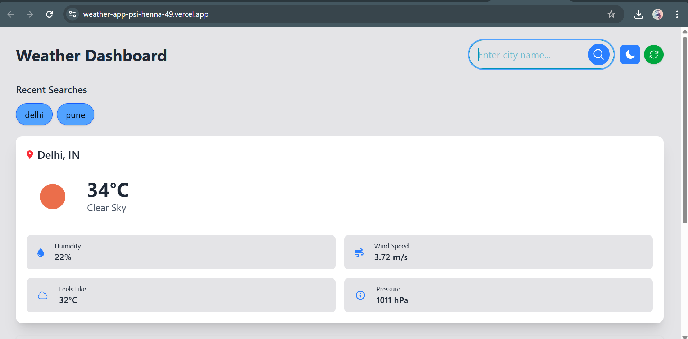
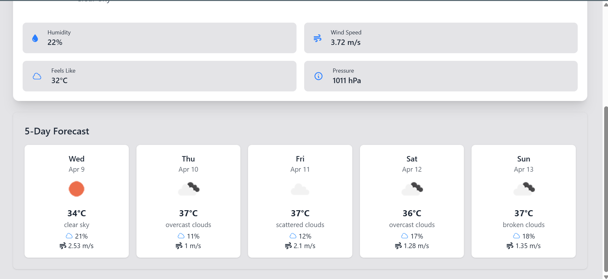
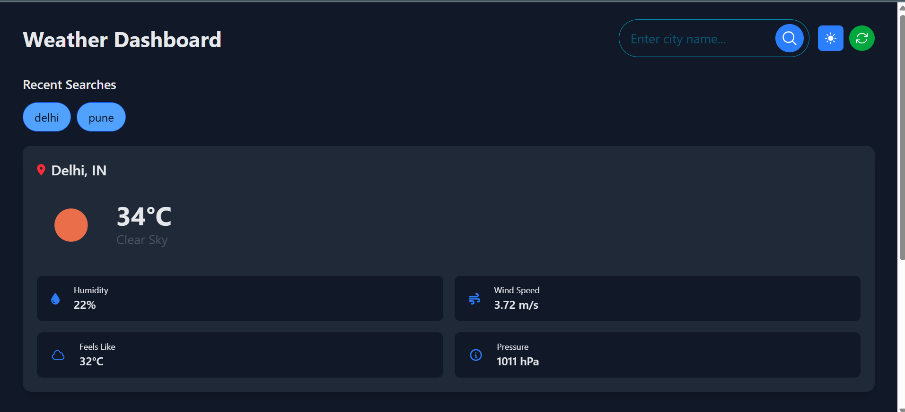
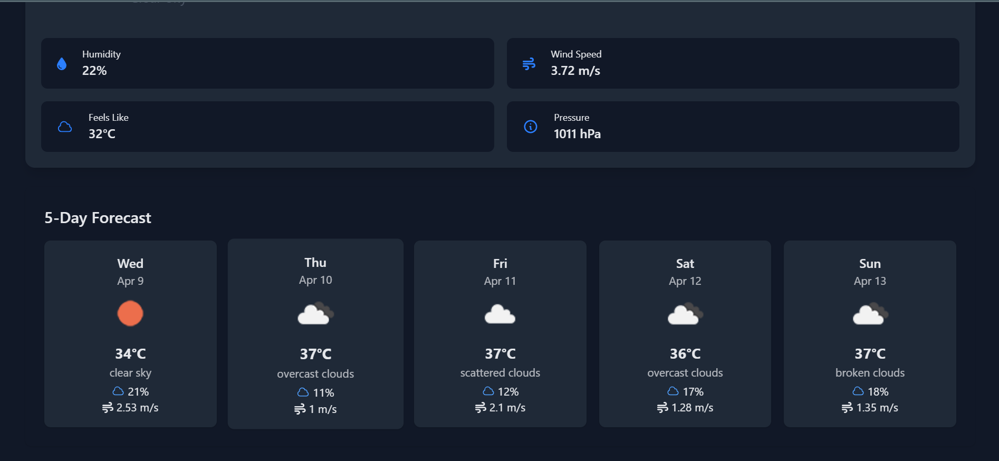

# 🌦️ Weather Dashboard

A sleek and responsive weather application built with **React**, **Tailwind CSS**, and **OpenWeatherMap API**. It provides real-time weather updates, a 5-day forecast, recent search history, and light/dark theme support.

---

## ✨ Features

- 🌍 **City Search:** Search weather by city name.
- 📦 **Current Weather:** Temperature, condition, humidity, wind, and more.
- 📅 **5-Day Forecast:** Grouped and displayed by day.
- 🕹️ **Dark/Light Mode:** Toggle UI themes (stored in localStorage).
- ♻️ **Refresh Button:** Reload weather for the last searched city.
- 🕵️ **Recent Searches:** Track and re-select recent search history (up to 5).
- ⏳ **Loading & Error Handling:** Feedback during API fetch or errors.

---

## 🛠️ Tech Stack

- **Frontend:** React, JSX, Tailwind CSS
- **Icons:** Heroicons & FontAwesome
- **State Management:** React Hooks (`useState`, `useEffect`)
- **API:** [OpenWeatherMap](https://openweathermap.org/api)

## Screenshots






## 📦 Dependencies
react, react-dom

@fortawesome/react-fontawesome

@fortawesome/free-solid-svg-icons

@heroicons/react

## 🙌 Acknowledgements
OpenWeatherMap API

Heroicon

Font Awesome

Tailwind CSS


## Add your API Key

Replace the placeholder with your actual OpenWeatherMap API key in your service function.

```js
const API_KEY = 'your_api_key_here';

const fetchCityWeather = async (city) => {
  const response = await fetch(
    `https://api.openweathermap.org/data/2.5/forecast?q=${city}&units=metric&appid=${API_KEY}`
  );
  return await response.json();
};


